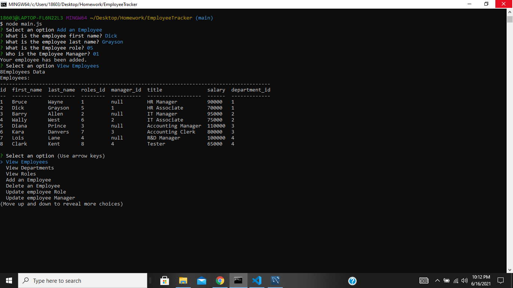

# Employee Tracker
Project designed to keep track and manage employees using node, inquirer, and mySQL

👨[Github Profile](https://github.com/PratikPatel-Code/)

📺[Video](https://drive.google.com/file/d/1DvpPdGivlHPRFKu5pr9prPQp71rIyuCs/view?usp=sharing)

#

## Table of Contents

- [Project Overview](#Overview)

- [Project Goals](#Goals)

- [Running App](#Running)

- [Testing App](#Testing)

- [Contributers](#Contributers)

- [Technologies](#Technologies)

- [Links](#Links)

#
## Overview:
The project is designed to create app called Employee Tracker, which will function as a why to interact with a companies database.  The user whould be able to view and manage the departments, roles, and employees in the company.

#
## Goals:
1. Add departments, roles, and employees
2. View departments, roles, and employees
3. Update employee roles

#
## Running: 🏃
- node.js must be installed
- Download the package.json
- run npm i
- mySql, inquirer, and console.table packages will install

#
## Testing: 🔬
- node connection.js - to test proper connection.
- node main.js - to run program.

# 

## Screenshot/Demo 📸

#

#

## Contributers:
👨[Pratik Patel](https://github.com/PratikPatel-Code/)

#
## Technologies: 💻
[Visual Studio](https://visualstudio.microsoft.com/)

[JavaScript](https://www.javascript.com/)

[Node](https://nodejs.org/en/)

[mySQL](https://www.npmjs.com/package/mysql)

[Inquirer](https://www.npmjs.com/package//inquirer)

[Console.Table](https://www.npmjs.com/package/console.table)

#
## Links: 🔗
✉️[Email](pratikpatel_85@yahoo.com)

👨[Github Profile](https://github.com/PratikPatel-Code/)

📺[Video](https://drive.google.com/file/d/1DvpPdGivlHPRFKu5pr9prPQp71rIyuCs/view?usp=sharing)

📁[Project Repo](https://github.com/PratikPatel-Code/NoteTaker)
